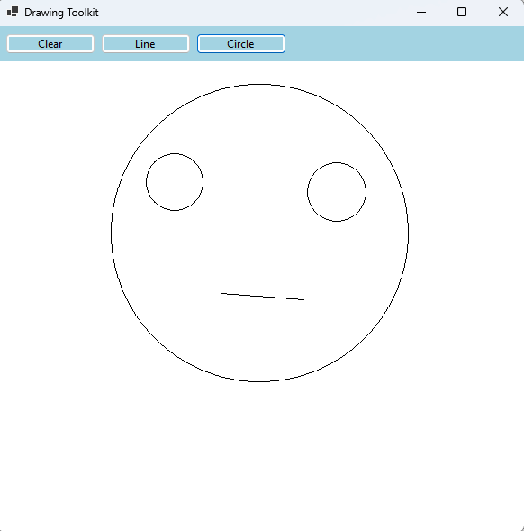
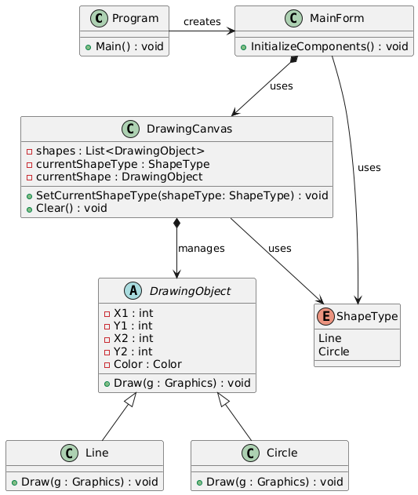

### Tutorial: Membuat Aplikasi Menggambar 2D Sederhana dengan C#

---

### **Tujuan**

Mempelajari cara membuat aplikasi sederhana untuk menggambar bentuk 2D seperti garis dan lingkaran di Windows Forms. Aplikasi juga memungkinkan pengguna menambahkan bentuk baru, seperti persegi panjang atau bentuk 2D lainnya.



---

### **Lingkungan Pengembangan**

1. **Platform**: .NET 6.0
2. **Bahasa**: C#
3. **IDE**: Visual Studio 2022

---

### **Pemodelan Objek**



#### **Kelas dan Penggunaannya**

1. **`Program`**:
   - Fungsi utama yang menjalankan aplikasi.
   - Menginstansiasi `MainForm`.

2. **`MainForm`**:
   - Form utama aplikasi yang berisi toolbar dan kanvas menggambar.
   - Mengelola interaksi pengguna dengan toolbar dan kanvas.

3. **`DrawingCanvas`**:
   - Panel tempat pengguna menggambar bentuk.
   - Menangani event mouse (`MouseDown`, `MouseMove`, `MouseUp`).
   - Menyimpan daftar semua bentuk (DrawingObject) yang telah digambar.
   - Menghapus seluruh bentuk DrawingObject.

4. **`DrawingObject`**:
   - Kelas abstrak untuk merepresentasikan bentuk dasar 2D seperti garis, lingkaran, atau persegi panjang.
   - Memiliki properti posisi (`X1`, `Y1`, `X2`, `Y2`) dan warna.
   - Menyediakan metode abstrak `Draw` yang akan diimplementasikan oleh kelas konkrit turunannya.

5. **`Line`**:
   - Turunan `DrawingObject` untuk menggambar garis.
   - Mengimplementasikan metode `Draw` untuk menggambar garis.

6. **`Circle`**:
   - Turunan `DrawingObject` untuk menggambar lingkaran.
   - Mengimplementasikan metode `Draw` untuk menggambar lingkaran.

7. **`ShapeType`**:
   - Enum yang merepresentasikan jenis bentuk yang dipilih (`Line`, `Circle`, dll.).

---

### **Langkah-langkah**

---

### **1. Membuat `MainForm`**

1. Buat kelas `MainForm` untuk menampilkan window kosong.
2. Tambahkan properti dasar, seperti ukuran window dan warna latar.

**Kode untuk `MainForm.cs`:**

```csharp
using System;
using System.Drawing;
using System.Windows.Forms;

namespace DrawingToolkit
{
    public class MainForm : Form
    {
        public MainForm()
        {
            this.Text = "Drawing Toolkit";
            this.Size = new Size(600, 600);
            this.StartPosition = FormStartPosition.CenterScreen;
            this.BackColor = Color.LightGray;
        }
    }
}
```

**Kode untuk `Program.cs`:**

```csharp
namespace DrawingToolkit
{
    internal static class Program
    {
        [STAThread]
        static void Main()
        {
            ApplicationConfiguration.Initialize();
            Application.Run(new MainForm());
        }
    }
}
```

**Jalankan aplikasi**:
- Sebuah window kosong akan muncul.

---

### **2. Membuat `ToolbarPanel` dan Tombol**

1. Tambahkan panel toolbar ke `MainForm`.
2. Tambahkan tombol **Clear**, **Line**, dan **Circle** ke toolbar.

**Perbarui `MainForm.cs`:**

```csharp
private Button clearButton, lineButton, circleButton;
private FlowLayoutPanel toolbarPanel;

public MainForm()
{
    InitializeComponents();
}

private void InitializeComponents()
{
    this.Text = "Drawing Toolkit";
    this.Size = new Size(600, 600);
    this.StartPosition = FormStartPosition.CenterScreen;

    toolbarPanel = new FlowLayoutPanel
    {
        Dock = DockStyle.Top,
        Height = 50,
        BackColor = Color.LightBlue,
        AutoSize = true,
        FlowDirection = FlowDirection.LeftToRight,
        Padding = new Padding(5)
    };

    clearButton = new Button { Text = "Clear", Width = 100 };
    lineButton = new Button { Text = "Line", Width = 100 };
    circleButton = new Button { Text = "Circle", Width = 100 };

    toolbarPanel.Controls.Add(clearButton);
    toolbarPanel.Controls.Add(lineButton);
    toolbarPanel.Controls.Add(circleButton);

    this.Controls.Add(toolbarPanel);
}
```

**Jalankan aplikasi**:
- Toolbar dengan tiga tombol muncul di bagian atas window.

---

### **3. Membuat `DrawingObject`**

1. Buat kelas abstrak `DrawingObject`.
2. Tambahkan properti posisi dan warna.
3. Tambahkan metode abstrak `Draw`.

**Kode untuk `DrawingObject.cs`:**

```csharp
using System.Drawing;

namespace DrawingToolkit
{
    public abstract class DrawingObject
    {
        public int X1 { get; set; }
        public int Y1 { get; set; }
        public int X2 { get; set; }
        public int Y2 { get; set; }
        public Color Color { get; set; }

        protected DrawingObject(int x1, int y1, int x2, int y2, Color color)
        {
            X1 = x1;
            Y1 = y1;
            X2 = x2;
            Y2 = y2;
            Color = color;
        }

        public abstract void Draw(Graphics g);
    }
}
```

---

### **4. Membuat `DrawingCanvas` dan Enum `ShapeType`**

1. Tambahkan `DrawingCanvas` sebagai panel untuk menggambar.

**Kode untuk `DrawingCanvas.cs`:**

```csharp
using System.Collections.Generic;
using System.Drawing;
using System.Windows.Forms;

namespace DrawingToolkit
{
    public class DrawingCanvas : Panel
    {
        private List<DrawingObject> shapes = new();
        private ShapeType currentShapeType = ShapeType.Line;
        private DrawingObject currentShape;

        public DrawingCanvas()
        {
            this.DoubleBuffered = true;
            this.BackColor = Color.White;

            this.MouseDown += OnMouseDown;
            this.MouseMove += OnMouseMove;
            this.MouseUp += OnMouseUp;
        }

        public void SetCurrentShapeType(ShapeType shapeType)
        {
            currentShapeType = shapeType;
        }

        protected override void OnPaint(PaintEventArgs e)
        {
            base.OnPaint(e);
            foreach (var shape in shapes)
            {
                shape.Draw(e.Graphics);
            }
        }

        private void OnMouseDown(object sender, MouseEventArgs e)
        {
            // Logic untuk menggambar drawing object berdasarkan currentShapeType
        }

        private void OnMouseMove(object sender, MouseEventArgs e)
        {
            // Logic untuk melakukan visualisasi drawing object ketika mouse digeser sesuai pointer.
        }

        private void OnMouseUp(object sender, MouseEventArgs e)
        {
            // Menyimpan drawing object ke dalam list
        }
    }
}
```

2. Tambahkan enum `ShapeType` untuk melacak bentuk yang dipilih.

**Kode untuk `ShapeType.cs`:**

```csharp
namespace DrawingToolkit
{
    public enum ShapeType
    {
        Line,
        Circle
    }
}
```

3. **Menambahkan `DrawingCanvas` ke `MainForm`**:
   - Tambahkan instance `DrawingCanvas` ke dalam form utama sebagai area menggambar.

**Perbarui `MainForm.cs`:**

```csharp
public class MainForm : Form
{
    // ... kode sebelumnya ...

    private DrawingCanvas canvas; // Instance untuk DrawingCanvas

    private void InitializeComponents()
    {
        // ... kode sebelumnya ...

        // Canvas
        canvas = new DrawingCanvas
        {
            Dock = DockStyle.Fill,
            BackColor = Color.White
        };
        this.Controls.Add(canvas);
    }
}
```

**Jalankan aplikasi**:
- Kanvas putih akan muncul di bawah toolbar.

---

### **5. Membuat Line dan Mengimplementasikan LineButton Click**

1. **Membuat Kelas `Line`**:
   - Buat kelas `Line` sebagai turunan dari `DrawingObject`.
   - Implementasikan metode `Draw` untuk menggambar garis.

**Kode untuk `Line.cs`:**

```csharp
namespace DrawingToolkit
{
    public class Line : DrawingObject
    {
        public Line(int x1, int y1, int x2, int y2, Color color)
            : base(x1, y1, x2, y2, color) { }

        public override void Draw(Graphics g)
        {
            using var pen = new Pen(Color);
            g.DrawLine(pen, X1, Y1, X2, Y2);
        }
    }
}
```

2. **Menghubungkan LineButton ke `DrawingCanvas`**:
   - Ketika tombol **Line** diklik, bentuk saat ini diatur ke `ShapeType.Line`.

**Perbarui `MainForm.cs`:**

```csharp
private void InitializeComponents()
{
    // ... kode sebelumnya ...

    lineButton.Click += (s, e) => canvas.SetCurrentShapeType(ShapeType.Line);
}

```

3. **Menangani Event Mouse di `DrawingCanvas`**:
   - Tambahkan logika untuk membuat objek `Line` ketika mouse ditekan.

**Perbarui `DrawingCanvas.cs`**:

```csharp
private void OnMouseDown(object sender, MouseEventArgs e)
{
    switch (currentShapeType)
    {
        case ShapeType.Line:
            currentShape = new Line(e.X, e.Y, e.X, e.Y, Color.Black);
            break;
    }

    shapes.Add(currentShape);
}
```

4. **Menggambar Garis**:
   - Saat mouse bergerak, perbarui titik akhir garis.
   - Saat mouse dilepaskan, tambahkan garis ke daftar bentuk.

**Perbarui `DrawingCanvas.cs`:**

```csharp
private void OnMouseMove(object sender, MouseEventArgs e)
{
    if (currentShape != null)
    {
        currentShape.X2 = e.X;
        currentShape.Y2 = e.Y;
        Invalidate();
    }
}

private void OnMouseUp(object sender, MouseEventArgs e)
{
    if (currentShape != null)
    {
        currentShape = null;
        Invalidate();
    }
}
```

**Jalankan aplikasi**:
- Pilih tombol **Line** dan gambar garis di area kanvas.

---

### **6. Membuat Circle dan Mengimplementasikan CircleButton Click**

1. **Membuat Kelas `Circle`**:
   - Buat kelas `Circle` sebagai turunan dari `DrawingObject`.
   - Implementasikan metode `Draw` untuk menggambar lingkaran.

**Kode untuk `Circle.cs`:**

```csharp
namespace DrawingToolkit
{
    public class Circle : DrawingObject
    {
        public Circle(int x1, int y1, int x2, int y2, Color color)
            : base(x1, y1, x2, y2, color) { }

        public override void Draw(Graphics g)
        {
            var width = X2 - X1;
            var height = Y2 - Y1;
            var size = Math.Min(Math.Abs(width), Math.Abs(height));

            using var pen = new Pen(Color);
            g.DrawEllipse(pen, X1, Y1, size, size);
        }
    }
}
```

2. **Menghubungkan CircleButton ke `DrawingCanvas`**:
   - Ketika tombol **Circle** diklik, bentuk saat ini diatur ke `ShapeType.Circle`.

**Perbarui `MainForm.cs`:**

```csharp

private void InitializeComponents()
{
    // ... kode sebelumnya ...

    circleButton.Click += (s, e) => canvas.SetCurrentShapeType(ShapeType.Circle);
}

```

3. **Menangani Event Mouse di `DrawingCanvas`**:
   - Tambahkan logika untuk membuat objek `Circle` ketika mouse ditekan.

**Perbarui `DrawingCanvas.cs`**:

```csharp
private void OnMouseDown(object sender, MouseEventArgs e)
{
    switch (currentShapeType)
    {
        // ... kode sebelumnya ...

        case ShapeType.Circle:
            currentShape = new Circle(e.X, e.Y, e.X, e.Y, Color.Black);
            break;
    }

    shapes.Add(currentShape);
}
```

**Jalankan aplikasi**:
- Pilih tombol **Circle** dan gambar lingkaran di area kanvas.

---

### **7. Mengimplementasikan ClearButton**

1. **Menambahkan event handling ketika ClearButton ditekan**:
   - Menghapus semua bentuk yang ada di `DrawingCanvas`.
   - Mereset area kanvas menjadi kosong.

2. **Menambahkan Fungsi `Clear` di `DrawingCanvas`**:
   - Tambahkan metode `Clear` untuk membersihkan daftar bentuk dan menggambar ulang kanvas.

**Kode untuk `DrawingCanvas.cs`:**

```csharp
public void Clear()
{
    shapes.Clear(); // Menghapus semua bentuk dari daftar
    Invalidate();   // Memicu ulang rendering kanvas
}
```

3. **Menghubungkan ClearButton ke `DrawingCanvas`**:
   - Ketika tombol **Clear** diklik, metode `Clear` di `DrawingCanvas` dipanggil.

**Modifikasi kode untuk `MainForm.cs`:**

```csharp
using System;
using System.Drawing;
using System.Windows.Forms;

namespace DrawingToolkit
{
    public class MainForm : Form
    {
        // ... kode sebelumnya ...

        private void InitializeComponents()
        {
            
            // ... kode sebelumnya ...

            // Event Handlers
            clearButton.Click += (s, e) => canvas.Clear();
        }
    }
}
```

4. **Jalankan Aplikasi dan Uji ClearButton**:
   - Gambar beberapa bentuk (garis dan lingkaran) di kanvas.
   - Klik tombol **Clear** untuk menghapus semua bentuk.

---

### **8. Tugas Tambahan**

1. Tambahkan tombol **Rectangle** di toolbar.
2. Implementasikan kelas baru `Rectangle` dengan logika menggambar persegi panjang.
3. Integrasikan tombol dan bentuk baru ke dalam `DrawingCanvas`. 

---

### **Pengujian**

1. Jalankan aplikasi.
2. Tambahkan beberapa bentuk (garis dan lingkaran) ke kanvas.
3. Klik tombol **Clear**.
   - Semua bentuk di kanvas akan hilang, menyisakan kanvas kosong.

---